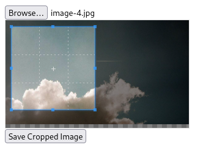
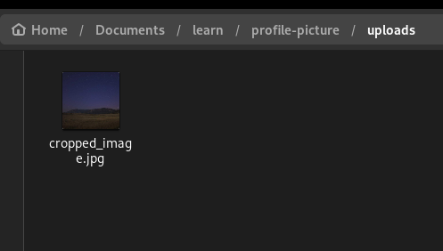

# Image Cropper and Zoomer

Crop and Zoom pictures before upload using cropper js.

## Requirements

- PHP

## Development

```
php -S localhost:8080
```

Below is an examle of how it works.



This is the output



Thank you.
